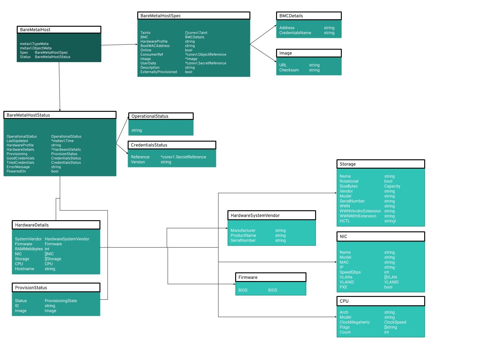

= Metal^3^ Objects =

== Diagram ==

.Metal^3^ Objects and Sub-objects
[#img-metal3-objects]
[caption="Figure 1: ",link=https://docs.google.com/drawings/d/1d-YEu8XjpPGtq1AldD5dewHSSrX64aRBRx7EzfUK-Ec/edit?usp=sharing]

== Details ==

_Metal3_ introduces the concept of _BareMetalHost_, which represents the defition of a physical machine, with its specific characteristics. The _BareMetalHost_ resource
embeds two well differentiated sections, the bare metal host specifications and its current status.

=== Script ===

[NOTE]
`oc describe baremetalhost openshift-master-0`

[NOTE]
*Do some intro before jumping into the objects.*

Beginning with the specification, which defines the desire state of the host, it contains mainly, but not only, provisioning details. Starting with BMC (Baseboard Management Controller) network address and a reference to the secret holding the credentials for connecting to it. Knowing how to connect to the BMC is the first step for deploying or in general for managing the host, as boot devices can be set, including PXE for deploying a new image onto the host, power states can be altered, etc. And this takes us to the next field, _Boot MAC Address_, on it we can see the MAC address used for PXE booting the host.

At this point, we're basically missing one thing, the image to be deployed on the host, as we can see on the screen, there is an URL pointing to the image itself and another one which points to a file holding the checksum to verify the image's integrity once downloaded. And to complement the image, the following section on the screen, after _Online_, is the _User Data_, or rather the name of the secret which holds the actual user provided data and its namespace, so it can be attached to the host at boot for configuring aspects of the OS (like networking, storage, ...).

To finish with the _spec_ section, we find the field _Online_ which indicates whether or not the host should be powered on, then _Consumer Ref_, which if not empty, the host is considered to be in use, for example by a _Machine_ resource, and finally, the field _Externally Provisioned_, that tells whether the host was provisioned by the cluster itself or externally.

Now let's move onto the next block, the host's status information which represents its current state. Two important sections here are credentials and hardware details, will start with the latter. As we can see in the screen, there are details about the current hardware set up, for instance, there is CPU information such as its model, the count and even the clock speed, amount of RAM in Mebibytes and following down a bit, there are the vendor and firmware information and the host name.

Within hardware details, there are also listed networking interfaces (NICs) and storage devices, each block is a list and contains an item for each interface or device found in the system. For each NIC, we can see its IP and MAC addresses, model, the interface name as configured by the OS, speed in gigabits/s, VLAN ID and whether the interface supports PXE booting. While for the storage devices, we can see the device's name, its capacity in bytes, vendor, model, its serial number, information about its WWN (World Wide Name) and whether the devices is rotational or not.

On the credentials side, we can see two blocks, _Good Credentials_ and _Tried Credentials_, the former is the laste set of credentials the system was able to validate as working while the latter are the last set of credentials that were sent to the provisioning backend. Note that we cannot really see the credentials here but rather a name of a secret and the name of the namespace where the secret lives, the credentials details are stored in that secret.

Following on in the status block, there are fields like _PoweredOn_ which is either true or false based on the current power state of the host, _Error Message_ if there is any, _provisioning_ status which holds information regarding the provisioning state and its details, finally we can find the host _operational status_ which can have three different values, _OK_ is the status representing that all the details are known and working, so the host is completely manageable, while _discovered_ state implies some details are either not working correctly or missing, finally, there is the _error_ state which means the system found some sort of irrecuperable error.

=== Bare Metal Host Specification ===

* Taints
** Taints are means to create anti-affinity, a node with one or multiple taints won't run pods that don't have the appropiated tolerations
* BMC details
** Baseboard Management Controller (BMC), provides the network address of the BMC device and the name of the secret holding the credentials details
* Hardware profile
** ???
* Boot MAC address
** MAC Address used for PXE booting
* Online
** This field indicates whether the physical machine should be online or not
* Consumer Refeference
** Holds information on what is using this host, when it contains data, the host is considered to be in use, for example used by a _Machine_ resource
* Image
** Holds details for the image to be used when provisioning the host
* UserData
** Contains a reference to a secret holding the actual user data that will be passed to the host before it boots
* Description
** Holds a human-entered text to help identifying the host
* Externally Provisioned
** Either true or false, indicating whether the host was externally provisioned

=== Bare Metal Host Status ===

* Operational Status
** The three possible values are _OK_, _discovered_ or _error_. _OK_ is the status value for when the host details are known and working, so the host is completely manageable,
while _discovered_ states that some of the host details are either not working correctly or missing. Finally the _error_ status means the system found any sort of error and needs to be corrected.
* Hardware Profile
** ??
* Hardware Details
** Basically, a list of the hardware composing the host, vendor information, firmware details such as version and release date, amount of RAM in MB, available storage and network interfaces, etc.
* Provisioning Status
** This field holds information about the provisioning state of the host, image used for provisioning and the ID of the host, a UUID
* Good/Tried credentials
** Last good set of credentials and last set of tried credentials
* Error messages
** 
* Powered On
** True or false, reflects the power state in the host
