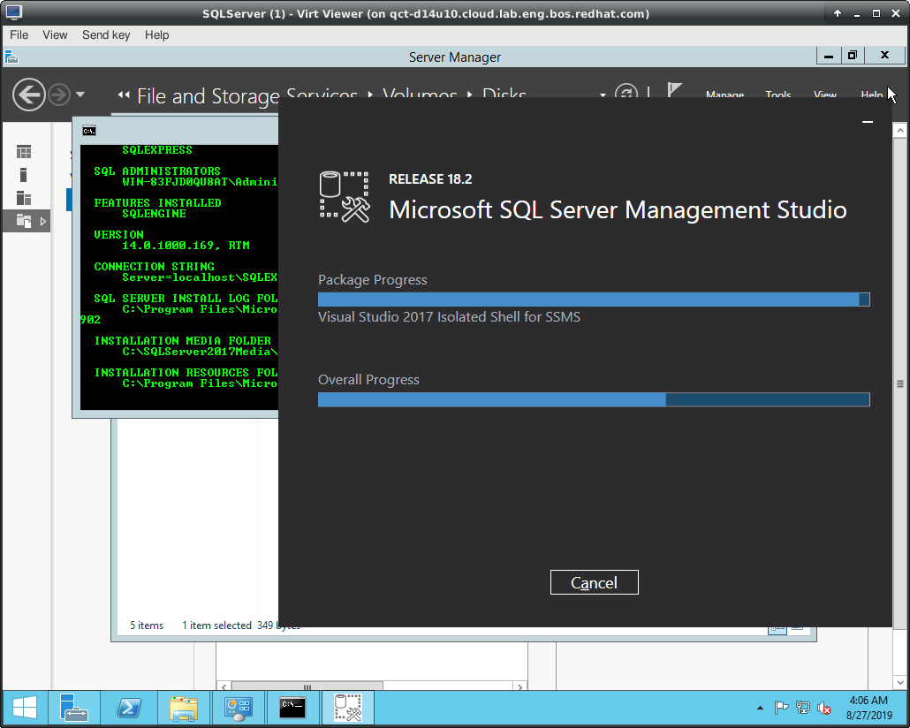
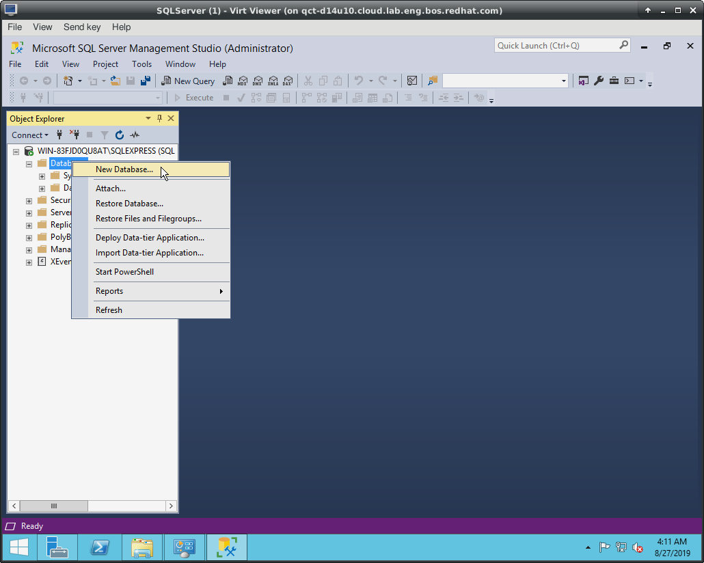

# Installing MS-SQL Express Using Pre-Existing Config File

MS-SQL "Express" is the free-to-use version of Microsoft SQL Server that allows users to create and store up to 10GB of data. For the purposes of demo this is probably more than enough and using the free version side steps any potential issues where we have to reinstall from scratch (for example updating SQL Server) without running into paywall or licensing issues that may delay the process.

## Prerequisites

* At least 1024MB of free (allocatable) memory.
* At least two cores that are generally unused by the VM for other processes.
* At least 10GB of free unallocated space on the `C:\` drive.

## Getting The Installation Files

This involves different files:

* [`InstallConfig.ini`](./InstallConfig.ini) is the SQL equivalent of a kickstart file for RHEL or an ignition file for CoreOS.
* [`install.bat`](./install.bat) Batch script for managing the installation
* `SQLServer2017-SSEI-Expr.exe` The installer for the free-to-use SQL Express server. This produces a headless service. This is just a stub and goes out to the internet to download the actual files. Get it from https://www.microsoft.com/en-us/download/details.aspx?id=55994
* `SSMS-Setup-ENU.exe` This is the full installer for Management Studio (analogous to MySQL's Workbench program) which produces a demo-able UI that Windows admins who use SQL server would be more familiar with. Get it from https://docs.microsoft.com/en-us/sql/ssms/download-sql-server-management-studio-ssms?view=sql-server-2017

## Running The Installation

To run the installation you just extract the zip file and run the `install.bat` install script. The result should be something similar to:

## Verifying The Installation

The installation itself should require no real input from the user and will just exit once it's finished. To verify a successful installation, just open Management Studio, tell it to connect to the local SQL Server instance using Windows authentication (these values should be pre-populated when you start Studio though).

You should then be able to successfully create a new databases like so:

